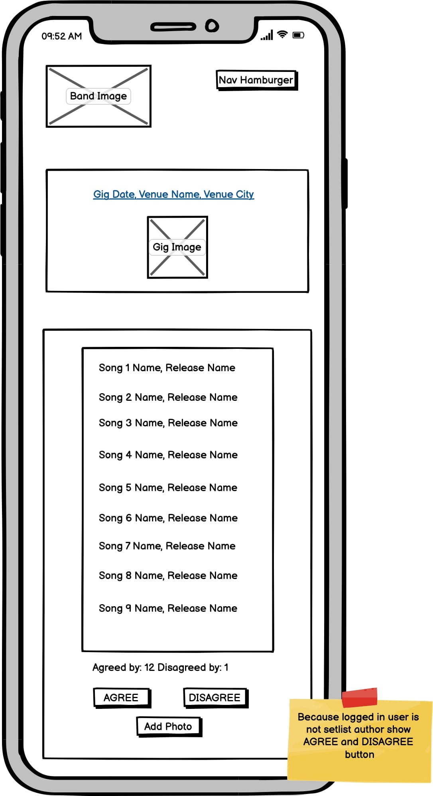
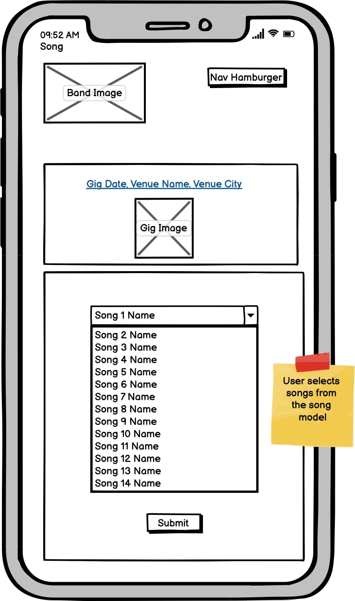

# Setlist Sharer


*Image created and taken from [Am I Responsive?](ami.responsivedesign.is).*

[View the live project here](https://mjjstockman.github.io/hull-college).

---

## Table of contents

1. [Introduction](#Introduction)
2. [Admin Setup](#Admin-Setup)
3. [UX and Design](#UX-and-design)
   - [User Demographics](#User-Demographics)
   - [User Stories](#User-Stories)
   - [Wireframes](#Wireframes)
   - [Database Design](#Database-design) 
   - [Kanban](#Kanban) 
   - [Changes to the design throughout development](#Changes-to-the-design-throughout-development)
   - [Typography](#typography)
4. [Features](#Features)
   - [Navigation and Header](#Navigation-and-Header)
   - [Hero Image](#Hero-Image)
   - [About Information Box](#About-Information-Box)
   - [Gigs](#Gigs)
   - [Setlists](#Setlists)
   - [Photos](#Photos)
   - [Footer](#Footer)
5. [Future Features](#Features-to-Implement-in-the-future)
6. [Testing](#Testing)
7. [Bugs](#Bugs)
8. [Deployment](#Deployment)
   - [How the site was Deployed](#How-the-site-was-Deployed)
   - [How to Fork the Repository](#How-to-Fork-the-Repository)
   - [How to create a Clone](#How-to-create-a-Clone-using-SSH)
   - [Heroku](#How-to-create-a-Clone-using-SSH)
   - [Heroku](#How-to-create-a-Clone-using-SSH)
9. [Credits](#Credits)
   - [Images](#Images)
   - [Acknowledgements](#Acknowledgements)

---

# Introduction

This is a fictional website (for educational purposes) for fans of a certain band to share the setlists the band has played at their gigs.  Not only does this help the fan feel like part of the bands fanbase, but allows other fans to see what songs the band have been playing live.

[Back to top ⇧](#Setlist-Sharer)

# Admin Setup

THE FOLLOWING HAS BEEN LEFT IN FOR FINAL DEPLOYMENT SO THE SITE CAN BE USED FROM THE START.  Please not that all images etc are only placeholders
and do not represent what will be included when the site is used properly.

Before the site can be used the admin will set up the required fields in the database, using the admin pannel in the following order:

1. Venues

The name of the Venue and the City.

2. Gigs

Once Venues have been entered the Gig Date and Venue can be added.  The Image selection will be left blank and the Image Status will be automatically set to "No Image".  When a user submits an image the status changes to 1.

3. Songs

The name of the bands song should then be entered.

4. Releases

The titles of the bands releases (this could be the name of a Single, EP, Album, Demo etc).  A song can appear on multiple releases and are selected whilst entering releases.

# Once Deployed
Once the site is in use the admin can change the status of submitted Setlists or Photos.  When they are set to "Published" they will be included in the site.

# UX and Design

[Back to top ⇧](#Setlist-Sharer)

## User Demographics

The target market are fans of the particular band, especially those who are wanting to feel conected to the band and part of their community.

[Back to top ⇧](#Setlist-Sharer)
## User Stories

User Stories were added to the Git Hub project board and can be read from [here](https://github.com/mjjstockman/setlistsharer/issues)

A kanban was used to keep an agile view on user stories.  Below is an example of the kanban at a particular set of time.

| Theme  | Epic | Related User Stories  | MOSCOW |Order | Completed |
|--|--|--|--|--|--|
| Account Management  |  Sign up |  #2 Sign up using username / password |  Must have  |1 |  No |
| 									|   |  #3 Sign up using social media |  Should have | 20 | No |
| 					| Sign in  |  #1  Log in using username / password | Must have | 2  | No |
| 					| 			 | #4  Log in using social media | Should have | 21 | No |
| 					| Log out  |  #5  Manual log out |   Must have | 3 | No |
| 					| 		|  #6  Automatic log out  | Won't have | 22 | No |
|  Admin 		| Initial set up |  #18  Populate database |  Must have |  4 |No |
|  				| Displaying setlists |  #13  Approve / reject a setlist submission | Must have  | 11 |  No | 
|  				| Displaying photos |  #14  Approve / reject a photo submission  | Could have | 18 |  No | 
|  				| Add venues |  #22 Add venues to the database   |  Must have  | 5  | No | 
|  				| Add gigs |  #17 Add gigs to the database   | Must have  | 6 | No | 
|  				| Add songs |  #16  Add song to the database  | Must have  | 7  |  No | 
|  				| Add releases |  #21  Add releases to the database | Must have  | 8 |  No |
| Setlist  |  Create a setlist |  #8  Submit a setlist  | Must have  | 10 |  No |
|  		|                               |  #19  Update setlist | Should have | 13 | No |  
|  		|                               |  #20  Delete setlist | Should have | 14  | No   |
|  		|    Interact with setlist         |  #9  Agree / disagree with a setlist |  Should have | 15 | No |  
|  		|                               |  #10  View numbers agreeing or disagreeing with a setlist | Should have | 16 | No |  
|  		|                               |  #11  Submit a photo of a gig | Could have | 17  | No |  
|  		|                               |  #12  View a photo of a gig | Could have | 19  | No |  
|  		|                               |  #15 View setlist | Must have  |  12 | No | 
|  	         |                               |  #7  View gigs on homepage | Must have  | 9  | No   |

[Back to top ⇧](#Setlist-Sharer)

## Wireframes

| Page | Image | 
| --------------| -------------- | 
| Home | 
| Setlist/detail | 
| Setlist/detail | 
| Setlist/add | 


Wireframes were being made for other screen sizes, but throught development it became clear that the design would be suitable across screen sizes, so the designs were scrapped.

*Images created and taken from [Balsamiq](https://balsamiq.com/wireframes)*

[Back to top ⇧](#Setlist-Sharer)

## Database Design


## Changes to the design throughout development

The design for the small sized screens were kept for all sizes.  

The home app was created to seperate some of the logic.  This is possibly not the best design to use but was done so to see how this would be implemented.  Another app called addimage was used to increase future usability in different apps, but this was not fully realised.  

[Back to top ⇧](#Setlist-Sharer)


## Typography

[Typespiration](https://typespiration.com/) was used to find complimenting [Google Font](https://fonts.google.com) pairings, with the following decided upon:

- Headings: Open Sans, with a fallback of serif. 
- Body: Crimson Text, with a fallback of sans-serif.

[Back to top ⇧](#Setlist-Sharer)

# Features

## Navigation and Header

The navigation bar allows the user to easily select which area of the site they wish to view. It will be located at the top of the site as this is common practice and is the area where most users eyes will be initially drawn to. It will be not be'sticky', as the main links a user will need when scrolling are provided. When a link is hovered over it becomes highlighted to help the user confirm they are about to select the relevant link. The highlight remains once selected.

The 'hamburger' icon was used on small screens (where the navigation bar will collapse and be represented as three horizontal lines. When touched/clicked, this displays the navigation in a dropdown menu). This is done due to the limited real estate space making the text hard to read when the screen is this size.


The logo is displayed on the left hand side and the nav on the right.

If the user is logged in the navigation displys the following links for Home and Logout:


If the user is not logged in the navigation displys the following links for Home and Sign Up and Login:


[Back to top ⇧](#Setlist-Sharer)
## Hero Image

An eye-catching full screen image is placed under the navigation. This helps grab the users attention and convey positive, professional feelings.  This also holds some text that is centered.


[Back to top ⇧](#Setlist-Sharer)

## About Information Box

A small section containing introductory information is placed below the hero image. This helps to quickly confirm to the user that they are on the correct site. It offers general information on the sites pupose, so they understand its goal.

[Back to top ⇧](#Setlist-Sharer)

## Gigs
All the gigs the admin has entered are shown on the hopme page with their date, venue and city.

Below the gig info an image is displayed with two buttons opposite.


[Back to top ⇧](#Setlist-Sharer)

## Setlists
If a setlist has not yet been submitted, the user can create one to submit by clicking on the Add Setlist button.

If a setlist has been submitted but not yet confirmed this is shown to the user.

If a setlist have been confirmed by the site admin they can be viewed by clicking on the View Setlist button.

If the author of a setlist is signed in they can edit or delete the setlist.

If the logged in user is not the author of the setlist they can agree or disagree with it by clicking on the appropriate button in the setlist detail page.

[Back to top ⇧](#Setlist-Sharer)

## Photos
If a photo has not yet been submitted, the user can create one to submit one clicking on the Add Photo button.

If a photo has been submitted but not yet confirmed this is shown to the user.

If a photo have been confirmed by the site admin they are displayed on the home page.


[Back to top ⇧](#Setlist-Sharer)

## Footer

The footer feature at the bottom of the page lets users know who it was developed by.


[Back to top ⇧](#Setlist-Sharer)

# Features to Implement in the future

Allow the order of songs played to be submitted and displayed.

Fully implement automated testing.

Combine the agree / disagree logic for setlists.
 
Automatically email the admin when a new setlist or photo has been selected.

Allow the user to delete a photo they have submitted.

Correctly seperate the project into seperate apps for reusability.  This was attempted (seperating adding an image and home etc. into their own models) but not fully realised due to time constraints.  Prefably, the addimage (and possibly the home app) models, views etc should have been moved back into the setlist app.

[Back to top ⇧](#Setlist-Sharer)


# Testing

Details on site testing can be found [here](TESTING.md).

[Back to top ⇧](#Hull-College)

# Bugs

## Bugs found throughout Development
Active pages were not being highlighted properly in the nav.  This was due to the nav being part of a base template.  The following article helped: https://stackoverflow.com/questions/39639264/django-highlight-current-page-in-navbar


## Remaining Bugs
The hero div is not resizing on larger screens.

[Back to top ⇧](#Setlist-Sharer)

# Deployment

## GitHub

The code was deployed to GitHub Pages in the following way:

Log into [GitHub](https://github.com/login) or [create an account](https://github.com/join).

Select the [GitHub Repository](https://github.com/mjjstockman/setlistsharer).

Open Settings by clicking on the Settings link (with the cog icon).

Scroll down to the GitHub Pages section and click on the link.

Click the dropdown box in the Source section (which currently states "none") and select master (this may be named "main" for some users).

Click Save.

The URL address for the deployed site will be shown.

[Back to top ⇧](#Setlist-sharer)

- - -

## How to Fork the Repository

Log into [GitHub](https://github.com/login) or [create an account](https://github.com/join).

Select the [GitHub Repository](https://github.com/mjjstockman/setlistsharer).

Click "Fork" at the top right of the page.

The repository will be copied into your GitHub account.

[Back to top ⇧](#Setlist-sharer)

- - - 

## How to create a Clone using SSH

Log into [GitHub](https://github.com/login) or [create an account](https://github.com/join).

Select the [GitHub Repository](https://github.com/mjjstockman/setlistsharer).

Click on the Code button.

Copy the provided SSH link.

Open Terminal.

Navigate into the directory you want to clone the repositroy to.

Type git clone and paste the copied URL.

```
$ git clone https://github.com/mjjstockman/https://github.com/mjjstockman/setlistsharer
```

Press **Enter**.

[Back to top ⇧](#Setlist-sharer)


# Create Heroku app
Go to https://www.heroku.com/ and login/signup

Click on the New button

In the Resources tab search for Heroku postgres in the Add-ons search box and add to the project.

In the Settings tab click on Reveal Config Vars button

Copy or make a note of the value of the DATABASE_URL var

[Back to top ⇧](#Setlist-sharer)

# Attach PostgreSQL database 
In settings.py add the following below 'from pathlib import Path


    import os
    import dj_database_url
    if os.path.isfile('env.py'):
    	import env
 
 Comment out DATABASES and add the following:

    DATABASES = {
	    'default':dj_database_url.parse(os.environ.get('DATABASE_URL'))
     }

Migrate changes

[Back to top ⇧](#Setlist-sharer)
# Prepare environment and settings.py files
Add a env.py file to the root directory if it does not exist

Add env.py to the .gitignore file

Add the following in env.py and save the file:

    
    os.environ[‘DATABASE_URL’] = <‘YOUR_DATABASE_URL’>
    os.environ[‘SECRET_KEY’] = <‘RANDOM_SECRET_KEY’>
   

Copy your SECRET_KEY

Add SECRET_KEY to Heroku Config vars 

Change SECRET_KEY key in settings.py to:

    SECRET_KEY  =  os.environ.get('SECRET_KEY')

[Back to top ⇧](#Setlist-sharer)

# Store static and media files on Cloudinary

Go to cloudinary.com and login/signup

In the Dashboard copy your API Environment variable

In env.py add:

    os.environ[‘CLOUDINARY_URL’] = <‘CLOUDINARY_API_ENVIRONMENT_VAR’ (with  ‘CLOUIDINARY_URL=‘ removed)>
*Note the removal of ‘CLOUIDINARY_URL=' at the beginning of the key*

Copy above and add to Heroku Config vars


In settings.py add the following to INSTALLED_APPS:

    ‘cloudinary_storage’

*This must go above django.contrib.staticfiles*

  Following django.contrib.staticfiles add:

    'django.contrib.staticfiles',
    'cloudinary'

Add following to settings.py:

    STATIC_URL = '/static/'
    STATICFILES_STORAGE = 'cloudinary_storage.storage.StaticHashedCloudinaryStorage'
    STATICFILES_DIRS = [os.path.join(BASE_DIR, 'static')]
    STATIC_ROOT = os.path.join(BASE_DIR, 'staticfiles')
    
    MEDIA_URL = '/media/'
    DEFAULT_FILE_STORAGE = 'cloudinary_storage.storage.MediaCloudinaryStorage'


Add the following below BASE_DIR declaration:

    TEMPLATES_DIR = os.path.join(BASE_DIR, 'templates')

Change 'DIRS' key to TEMPLATES_DIR:

    'DIRS': [TEMPLATES_DIR],

Add `ALLOWED_HOSTS = ['setlist-sharer-this.herokuapp.com', 'localhost']`

Add media, templates and static folders to root level

Create Procfile at root level and add:

    web: gunicorn setlistsharer.wsgi

Add, commit and push to your repo

In the Deploy tab in Heroku click on GitHub for the Deployment method

Search for the repo and click the Connect button

Click on the Deploy Branch button

Click on the Open app button to open the project

[Back to top ⇧](#Setlist-sharer)

# Google Authentification
In order to allow users to register and login using Google.
See [here](https://www.section.io/engineering-education/django-google-oauth/) for detailed instructions.

# Credits

Many thanks to the following which were used throughout the creation of this site:

- [w3c Markup Validator](https://validator.w3.org)
- [Am I Responsive?](http://ami.responsivedesign.is)
- [Balsamiq](https://balsamiq.com/)
- [Coolors](https://coolors.co/)
- [Design Course tutorial](https://www.youtube.com/watch?v=z9H7p1_iI14)
- [Favicon.io](https://favicon.io)
- [Font Awesome](https://fontawesome.com)
- [Free Formatter](https://www.freeformatter.com/)
- [Google Fonts](https://fonts.google.com)
- [Git](https://git-scm.com)
- [GitHub](https://github.com)
- [Pexels](https://www.pexels.com)
- [Responsinator](http://www.responsinator.com)
- [Super Cool Design](https://supercooldesign.co.uk/blog/how-to-write-good-alt-text)
- [Typespiration](https://typespiration.com)


[Back to top ⇧](#Hull-College)

## Images

The Hero image was taken from [Adobe Stock Image](https://stock.adobe.com/).

All other images were taken from [Pexels](https://www.pexels.com/).

[Back to top ⇧](#Hull-College)

## Acknowledgements

- Many thanks to my mentor for guidance.
- Thank you to the Code Institute Slack community for their advice.
- A wonderful [README.md](https://github.com/rebeccatraceyt/KryanLive) by [Rebecca Tracey-Timoney](https://github.com/rebeccatraceyt) was used for inspiration and guidance.

[Back to top ⇧](#Hull-College)