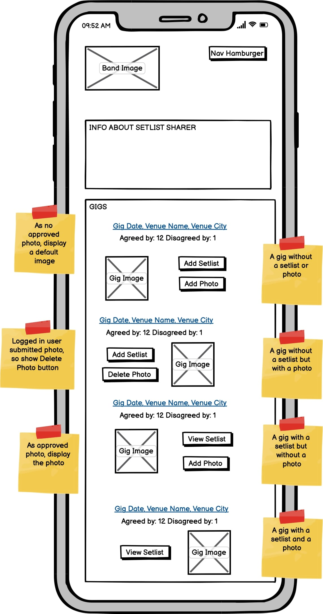
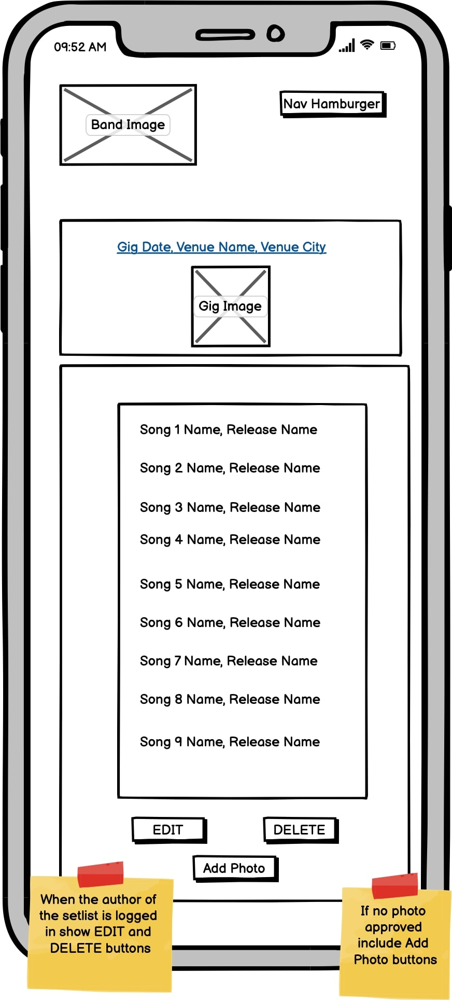
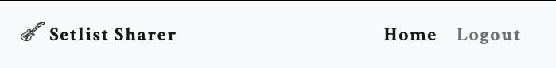

# Setlist Sharer Testing


# Automatic Testing
The urls were automatically tested in the TestUrls test case class within setlists/tests.py and confirn that the correct urls are being called.


Progress was made on further manual tests, but due to time constraints were scrapped.  The beginings of this can be viewed below, where the necessary objects were initialy created for the tests.


# Manual Testing

A lot of the funcionaity from this site comes from the admin set up (admin adding Songs, Releases, Gigs etc) before the site can be used.  As this is provided through Django this does not need to be tested.  The accounts side of the site (Signup, Login etc) is implemented through Allauth, which again does not need to be tested.

However, the following has been tested manualy:

## Home Page Gig Buttons
There are numerous options for the Gig Buttons on the home page. 

### Gigs with no Setlist
Those without a setlist have the Add Setlist button displayed next to them:


### Gigs with a Setlist awaiting Confirmation
Those that have had a setlist submitted, but not yet published by the site admin show that it is Waiting Confirmation:


### Gigs with a Published Setlist
Gigs with a published Setlist have the View Setlist button displayed:


### Gigs with no Photo
Such gigs have the Add Photo button displayed next to them:


### Gigs with a Photo awaiting Confirmation
Those that have had a photo submitted, but not yet published by the site admin show that it is Waiting Confirmation:


### Gigs with a Published Photo
No Photo button is displayed, but the image is shown:


## Edit / Delete a Setlist

## Agree / Disagree with a Setlist

This is a fictional website (for educational purposes) for fans of a certain band to share the setlists the band has played at their gigs.  Not only does this help the fan feel like part of the bands fanbase, but allows other fans to see what songs the band have been playing live.


[Back to top ⇧](#Setlist-Sharer)

# UX and Design

## User Demographics

The target market are fans of the particular band, especially those who are wanting to feel conected to the band and part of their community.

[Back to top ⇧](#Setlist-Sharer)
## User Stories

| Theme  | Epic | Related User Stories  | MOSCOW |Order | Completed |
|--|--|--|--|--|--|
| Account Management  |  Sign up |  #2 Sign up using username / password |  Must have  |1 |  No |
| 									|   |  #3 Sign up using social media |  Should have | 20 | No |
| 					| Sign in  |  #1  Log in using username / password | Must have | 2  | No |
| 					| 			 | #4  Log in using social media | Should have | 21 | No |
| 					| Log out  |  #5  Manual log out |   Must have | 3 | No |
| 					| 		|  #6  Automatic log out  | Won't have | 22 | No |
|  Admin 		| Initial set up |  #18  Populate database |  Must have |  4 |No |
|  				| Displaying setlists |  #13  Approve / reject a setlist submission | Must have  | 11 |  No | 
|  				| Displaying photos |  #14  Approve / reject a photo submission  | Could have | 18 |  No | 
|  				| Add venues |  #22 Add venues to the database   |  Must have  | 5  | No | 
|  				| Add gigs |  #17 Add gigs to the database   | Must have  | 6 | No | 
|  				| Add songs |  #16  Add song to the database  | Must have  | 7  |  No | 
|  				| Add releases |  #21  Add releases to the database | Must have  | 8 |  No |
| Setlist  |  Create a setlist |  #8  Submit a setlist  | Must have  | 10 |  No |
|  		|                               |  #19  Update setlist | Should have | 13 | No |  
|  		|                               |  #20  Delete setlist | Should have | 14  | No   |
|  		|    Interact with setlist         |  #9  Agree / disagree with a setlist |  Should have | 15 | No |  
|  		|                               |  #10  View numbers agreeing or disagreeing with a setlist | Should have | 16 | No |  
|  		|                               |  #11  Submit a photo of a gig | Could have | 17  | No |  
|  		|                               |  #12  View a photo of a gig | Could have | 19  | No |  
|  		|                               |  #15 View setlist | Must have  |  12 | No | 
|  	         |                               |  #7  View gigs on homepage | Must have  | 9  | No   |

[Back to top ⇧](#Setlist-Sharer)

## Wireframes

| Page | Small screens | Medium screens | Largescreens |
| --------------| -------------- | ------------ |  ------------ |
| Home | | ADD LINK | ADDLINK |
| Setlist/detail | | ADD LINK | ADDLINK |
| Setlist/detail | |  ADD LINK | ADDLINK |
| Setlist/add | | ADD LINK | ADDLINK |

*Images created and taken from [Balsamiq](https://balsamiq.com/wireframes)*

[Back to top ⇧](#Hull-College)

## Database Design


## Changes to the design throughout development

The original design was slightly different to the above wireframes. The following particulars were changed during implementation to better the user experience and aesthetics:

The header was changed so that the logo was centered and the navigation drops underneath when the screen is reduced to a particular size. This meant that the navigation links did not get too close together.

Form labels were moved above their inputs, placeholders removed and all inputs and the submit button were stacked and the same width.

A map showing the colleges location was added to the contact section.

[Back to top ⇧](#Hull-College)

## Colour Scheme

Blue was chosen as the main colour for the site. Research had shown that this is a colour associated with reliability, productivity, trust and order, which are the principles the college wish to promote.

[Coolors](https://coolors.co/) was then used to find a mix of blues for the main colour palette, with the following decided upon:

- Header: #03045e 
- About: #caf0f8 
- Courses: #90e0ef 
- Contact: #00b4d8 
- Footer: #0077b6 


- Main text: #12130f 
- Navigation and footer text/icons: #fffafa 
- Accent color: #800080 
- Submit button: #faf482 

[Back to top ⇧](#Hull-College)

## Typography

[Typespiration](https://typespiration.com/) was used to find complimenting [Google Font](https://fonts.google.com) pairings, with the following decided upon:

- Headings: Open Sans, with a fallback of serif. 
- Body: Crimson Text, with a fallback of sans-serif.

[Back to top ⇧](#Hull-College)

# Features

## Navigation and Header

The navigation bar allows the user to easily select which area of the site they wish to view. It will be located at the top of the site as this is common practice and is the area where most users eyes will be initially drawn to. It will be not be'sticky', as the main links a user will need when scrolling are provided. When a link is hovered over it becomes highlighted to help the user confirm they are about to select the relevant link. The highlight remains once selected.

The 'hamburger' icon was used on small screens (where the navigation bar will collapse and be represented as three horizontal lines. When touched/clicked, this displays the navigation in a dropdown menu). This is done due to the limited real estate space making the text hard to read when the screen is this size.


The logo is displayed on the left hand side and the nav on the right.

If the user is logged in the navigation displys the following links for Home and Logout:



If the user is not logged in the navigation displys the following links for Home and Sign Up and Login:


<!--  -->


[Back to top ⇧](#Hull-College)

## Hero Image

An eye-catching full screen image is placed under the navigation. This helps grab the users attention and convey positive, professional feelings.  This also holds some text that is centered.


[Back to top ⇧](#Hull-College)

## About Information Box

A small section containing introductory information is placed below the hero image. This helps to quickly confirm to the user that they are on the correct site. It offers general information on the sites pupose, so they understand its goal.


[Back to top ⇧](#Hull-College)

## Gigs
All the gigs the admin has entered are shown on the hopme page with their date, venue and city.

Below the gig info an image is displayed with two buttons opposite.


## Setlists
If a setlist has not yet been submitted, the user can create one to submit by clicking on the Add Setlist button.

If a setlist has been submitted but not yet confirmed this is shown to the user.

If a setlist have been confirmed by the site admin they can be viewed by clicking on the View Setlist button.

If the author of a setlist is signed in they can edit or delete the setlist.

If the logged in user is not the author of the setlist they can agree or disagree with it by clicking on the appropriate button in the setlist detail page.

## Photos
If a photo has not yet been submitted, the user can create one to submit one clicking on the Add Photo button.

If a photo has been submitted but not yet confirmed this is shown to the user.

If a photo have been confirmed by the site admin they are displayed on the home page.


[Back to top ⇧](#Hull-College)

## Footer

The footer feature at the bottom of the page contains links to Hull Colleges social media links. This will help users find more information and stay up to date with the college. The links open in a new tab, so users are not taken away from Hull College's website. They are the same colour as those in the navigation for consistency and to help them stand out.


[Back to top ⇧](#Hull-College)

# Features to Implement in the future

Add a dropdown to each course in the Courses section containing information on the course.

Add script to dynamically display how many characters are left for the form textarea.

Remove inline JavaScript in index.html into a separate script folder.  This was not done as it was outside the scope of the project.
 
The active navigation highlighting does not always work correctly on scroll.  This feature was not fixed as the use of JavaScript is outside the scope of the project.

# Technologies Used

## Main Languages Used

- HTML
- CSS


# Testing

Details on site testing can be found [here](TESTING.md).

[Back to top ⇧](#Hull-College)

# Deployment

## GitHub

The code was deployed to GitHub Pages in the following way:

Log into [GitHub](https://github.com/login) or [create an account](https://github.com/join).

Select the [GitHub Repository](https://github.com/mjjstockman/setlistsharer).

Open Settings by clicking on the Settings link (with the cog icon).

Scroll down to the GitHub Pages section and click on the link.

Click the dropdown box in the Source section (which currently states "none") and select master (this may be named "main" for some users).

Click Save.

The URL address for the deployed site will be shown.

[Back to top ⇧](#Setlist-sharer)

- - -

## How to Fork the Repository

Log into [GitHub](https://github.com/login) or [create an account](https://github.com/join).

Select the [GitHub Repository](https://github.com/mjjstockman/setlistsharer).

Click "Fork" at the top right of the page.

The repository will be copied into your GitHub account.

[Back to top ⇧](#Setlist-sharer)

- - - 

## How to create a Clone using SSH

Log into [GitHub](https://github.com/login) or [create an account](https://github.com/join).

Select the [GitHub Repository](https://github.com/mjjstockman/setlistsharer).

Click on the Code button.

Copy the provided SSH link.

Open Terminal.

Navigate into the directory you want to clone the repositroy to.

Type git clone and paste the copied URL.

```
$ git clone https://github.com/mjjstockman/https://github.com/mjjstockman/setlistsharer
```

Press **Enter**.

[Back to top ⇧](#Setlist-sharer)


# Create Heroku app
Go to https://www.heroku.com/ and login/signup

Click on the New button

In the Resources tab search for Heroku postgres in the Add-ons search box and add to the project.

In the Settings tab click on Reveal Config Vars button

Copy or make a note of the value of the DATABASE_URL var

[Back to top ⇧](#Setlist-sharer)

# Attach PostgreSQL database 
In settings.py add the following below 'from pathlib import Path


    import os
    import dj_database_url
    if os.path.isfile('env.py'):
    	import env
 
 Comment out DATABASES and add the following:

    DATABASES = {
	    'default':dj_database_url.parse(os.environ.get('DATABASE_URL'))
     }

Migrate changes

[Back to top ⇧](#Setlist-sharer)
# Prepare environment and settings.py files
Add a env.py file to the root directory if it does not exist

Add env.py to the .gitignore file

Add the following in env.py and save the file:

    
    os.environ[‘DATABASE_URL’] = <‘YOUR_DATABASE_URL’>
    os.environ[‘SECRET_KEY’] = <‘RANDOM_SECRET_KEY’>
   

Copy your SECRET_KEY

Add SECRET_KEY to Heroku Config vars 

Change SECRET_KEY key in settings.py to:

    SECRET_KEY  =  os.environ.get('SECRET_KEY')

[Back to top ⇧](#Setlist-sharer)

# Store static and media files on Cloudinary

Go to cloudinary.com and login/signup

In the Dashboard copy your API Environment variable

In env.py add:

    os.environ[‘CLOUDINARY_URL’] = <‘CLOUDINARY_API_ENVIRONMENT_VAR’ (with  ‘CLOUIDINARY_URL=‘ removed)>
*Note the removal of ‘CLOUIDINARY_URL=' at the beginning of the key*

Copy above and add to Heroku Config vars


In settings.py add the following to INSTALLED_APPS:

    ‘cloudinary_storage’

*This must go above django.contrib.staticfiles*

  Following django.contrib.staticfiles add:

    'django.contrib.staticfiles',
    'cloudinary'

Add following to settings.py:

    STATIC_URL = '/static/'
    STATICFILES_STORAGE = 'cloudinary_storage.storage.StaticHashedCloudinaryStorage'
    STATICFILES_DIRS = [os.path.join(BASE_DIR, 'static')]
    STATIC_ROOT = os.path.join(BASE_DIR, 'staticfiles')
    
    MEDIA_URL = '/media/'
    DEFAULT_FILE_STORAGE = 'cloudinary_storage.storage.MediaCloudinaryStorage'


Add the following below BASE_DIR declaration:

    TEMPLATES_DIR = os.path.join(BASE_DIR, 'templates')

Change 'DIRS' key to TEMPLATES_DIR:

    'DIRS': [TEMPLATES_DIR],

Add `ALLOWED_HOSTS = ['setlist-sharer-this.herokuapp.com', 'localhost']`

Add media, templates and static folders to root level

Create Procfile at root level and add:

    web: gunicorn setlistsharer.wsgi

Add, commit and push to your repo

In the Deploy tab in Heroku click on GitHub for the Deployment method

Search for the repo and click the Connect button

Click on the Deploy Branch button

Click on the Open app button to open the project

[Back to top ⇧](#Setlist-sharer)


# Credits

Many thanks to the following which were used throughout the creation of this site:

- [w3c Markup Validator](https://validator.w3.org)
- [Adobe Stock Image](https://stock.adobe.com)
- [Am I Responsive?](http://ami.responsivedesign.is)
- [Balsamiq](https://balsamiq.com/)
- [Coolors](https://coolors.co/)
- [Design Course tutorial](https://www.youtube.com/watch?v=z9H7p1_iI14)
- [Embed My Map](https://www.embedmymap.com/)
- [Favicon.io](https://favicon.io)
- [Font Awesome](https://fontawesome.com)
- [Free Formatter](https://www.freeformatter.com/)
- [Google Fonts](https://fonts.google.com)
- [Git](https://git-scm.com)
- [GitHub](https://github.com)
- [Json Formatter](https://jsonformatter.org/markdown-formatter)
- [Lighthouse](https://developers.google.com/web/tools/lighthouse)
- [Looka](https://looka.com/)
- [Malsu Codepen](https://codepen.io/malsu/pen/VwKzoPG)
- [Pexels](https://www.pexels.com)
- [Placeholder.com/](https://placeholder.com)
- [Responsinator](http://www.responsinator.com)
- [Squoosh](https://squoosh.app)
- [Super Cool Design](https://supercooldesign.co.uk/blog/how-to-write-good-alt-text)
- [TinyPNG](https://tinypng.com)
- [Typespiration](https://typespiration.com)


[Back to top ⇧](#Hull-College)

## Images

The Hero image was taken from [Adobe Stock Image](https://stock.adobe.com/).

All other images were taken from [Pexels](https://www.pexels.com/).

[Back to top ⇧](#Hull-College)

## Acknowledgements

- Many thanks to my mentor for guidance.
- Thank you to the Code Institute Slack community for their advice.
- A wonderful [README.md](https://github.com/rebeccatraceyt/KryanLive) by [Rebecca Tracey-Timoney](https://github.com/rebeccatraceyt) was used for inspiration and guidance.

[Back to top ⇧](#Hull-College)